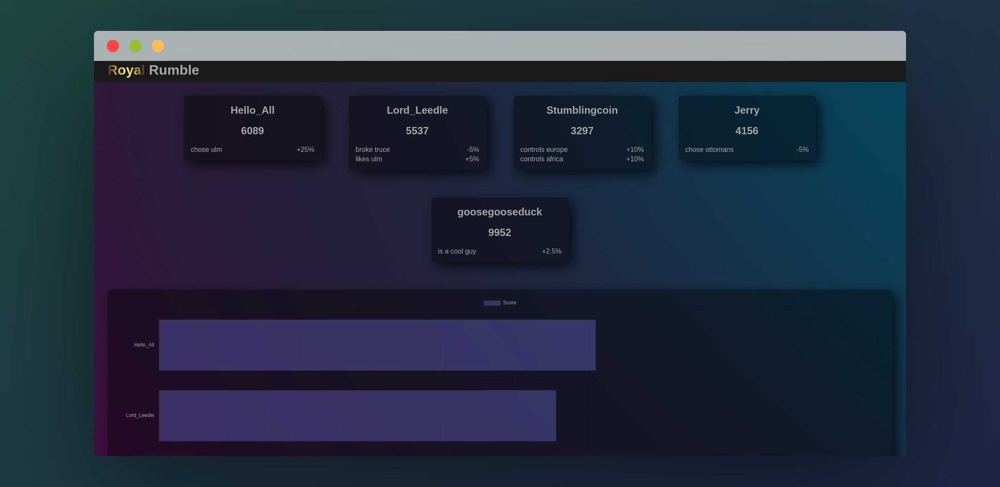
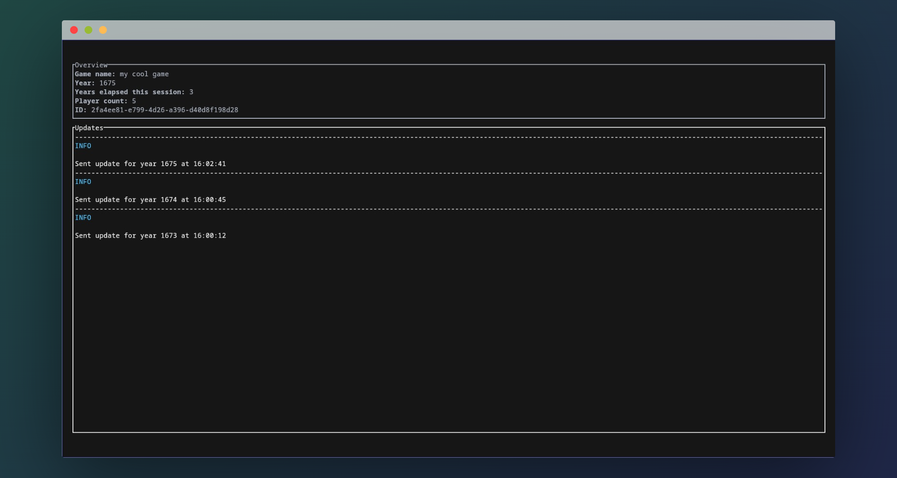

# MOC

MOC (Master of Ceremonies) is a tool to facilitate Europa Universalis IV multiplayer games. It allows custom modifiers to be placed on players' scores. Scores are tracked in realtime and uploaded to a website.  

### Frontend

### Parser Dashboard

## Features

**A web frontend**
- Displays modified scores
- Displays modifiers
- Displays graph(s)
- Admin page

**A TUI parser program**
- Allows the creation and selection of games
